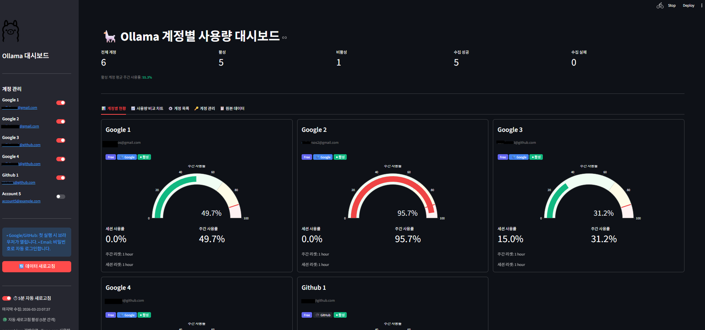
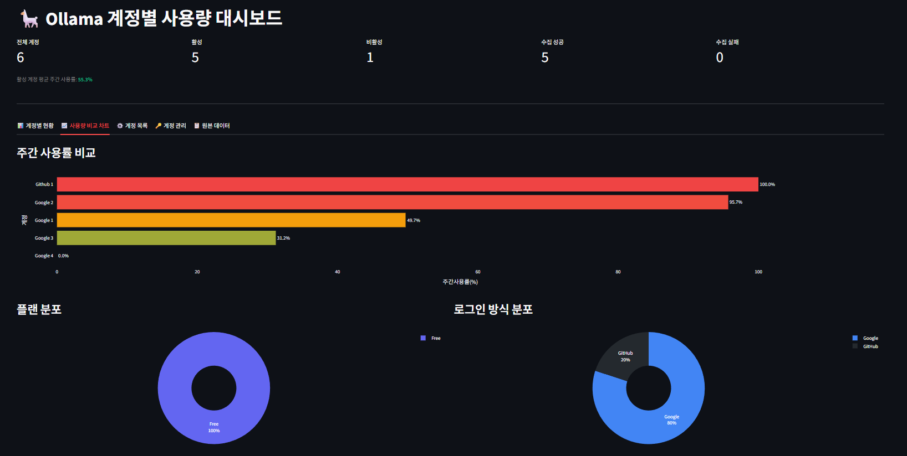

# Ollama 계정 사용량 대시보드

ollama.com의 여러 계정(Google, GitHub, Email)의 세션/주간 사용량을 수집하여 Streamlit 대시보드로 시각화하는 도구입니다.

## 주요 기능

- 다중 계정 사용량 일괄 수집 (Playwright 헤드리스 브라우저)
- 세션 사용률 / 주간 사용률 게이지 차트
- 계정별 플랜(Free / Pro / Max) 및 리셋 시간 표시
- 5분 자동 새로고침
- 계정 추가/삭제, 활성/비활성 토글
- Google/GitHub 계정: 쿠키 붙여넣기로 세션 등록
- Email 계정: `account.json`의 비밀번호로 자동 로그인

## 설치 및 실행

### 1. 패키지 설치

```bash
pip install -r requirements.txt
playwright install chromium
```

### 2. 계정 설정

`account.json` 파일을 생성하여 계정 정보를 입력합니다.

```json
[
  {
    "id": 1,
    "name": "Google 계정 1",
    "email": "your@gmail.com",
    "provider": "google",
    "active": true
  },
  {
    "id": 2,
    "name": "Email 계정",
    "email": "your@example.com",
    "password": "yourpassword",
    "provider": "email",
    "active": true
  }
]
```

> **주의**: `account.json`은 `.gitignore`에 포함되어 있어 Git에 커밋되지 않습니다.

| 필드 | 설명 |
|------|------|
| `provider` | `"google"` \| `"github"` \| `"email"` |
| `active` | `false`로 설정하면 해당 계정 수집을 건너뜁니다 |
| `password` | `provider`가 `"email"`일 때만 필요 |

### 3. 대시보드 실행

```bash
streamlit run dashboard.py
```

또는 Windows에서:

```bat
run.bat
```

## Google / GitHub 계정 세션 등록

OAuth 계정은 자동 로그인이 불가하므로 쿠키를 직접 등록해야 합니다.

**Network 탭 방식 (권장, httpOnly 쿠키 포함)**

1. 브라우저에서 ollama.com에 로그인
2. `F12` → **Network** 탭 → 페이지 새로고침(`F5`)
3. `ollama.com` 요청 클릭 → **Request Headers**의 `cookie:` 값 전체 복사
4. 대시보드 **계정 관리** 탭에서 해당 계정의 쿠키 입력란에 붙여넣기 후 저장

**Console 방식 (간단)**

1. ollama.com 페이지에서 `F12` → **Console** 탭
2. `document.cookie` 입력 후 Enter
3. 출력값 복사 → 대시보드에 붙여넣기

## 프로젝트 구조

```
ollama/
├── dashboard.py      # Streamlit 대시보드 (메인 UI)
├── scraper.py        # Playwright 기반 사용량 수집기
├── requirements.txt  # Python 패키지 목록
├── run.bat           # Windows 실행 스크립트
├── account.json      # 계정 정보 (gitignore 대상)
├── sessions/         # 계정별 쿠키 세션 (gitignore 대상)
└── usage_data.json   # 수집된 사용량 데이터 (gitignore 대상)
```

## 보안 주의사항

아래 파일들은 민감 정보를 포함하므로 `.gitignore`에 등록되어 있습니다.

| 파일/폴더 | 포함 정보 |
|-----------|-----------|
| `account.json` | 이메일, 비밀번호 |
| `sessions/` | 인증 쿠키/토큰 |
| `usage_data.json` | 개인 사용 데이터 |

## 의존성

| 패키지 | 용도 |
|--------|------|
| `playwright` | 헤드리스 브라우저로 사용량 스크래핑 |
| `streamlit` | 웹 대시보드 UI |
| `pandas` | 데이터 처리 |
| `plotly` | 게이지/차트 시각화 |


## 화면

<div align="center">
  
  
</div>